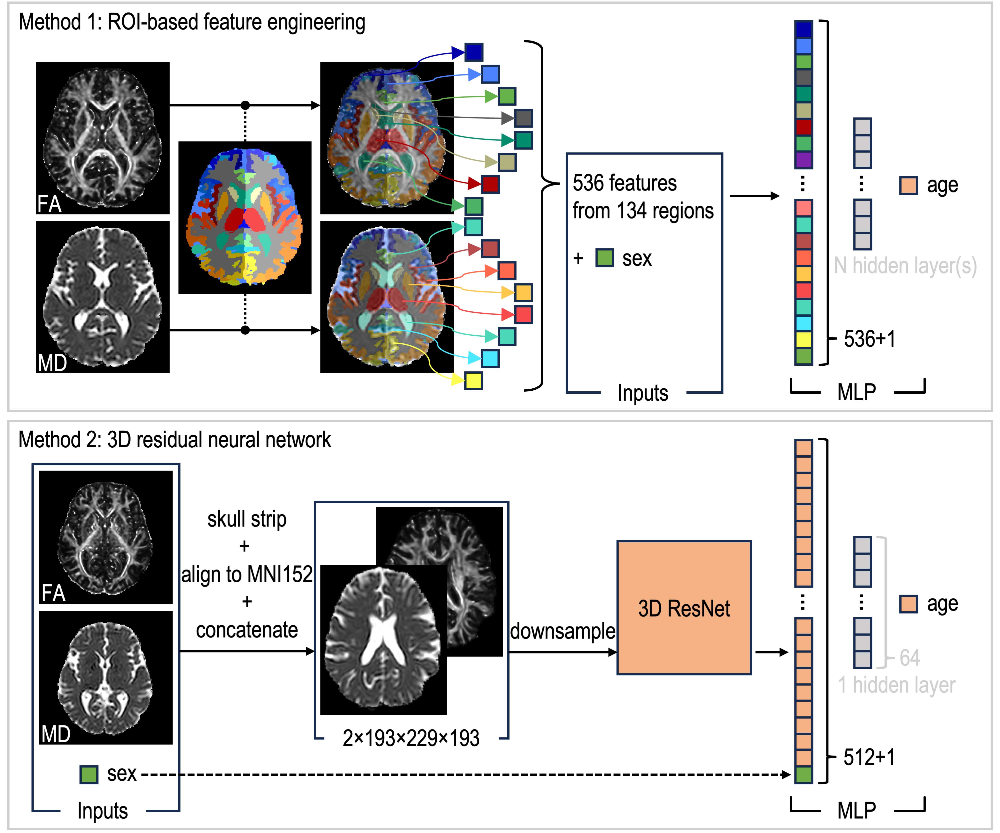

# Predict-Something-From-MRI

Repository for the paper "Predicting Age from White Matter Diffusivity with Residual Learning" submitted to SPIE 2024

### Abstract

Studies have attempted to leverage the advantages of diffusion tensor imaging (DTI), which provides age-related microstructural information, to predict age. However, there is no evidence that the accuracy of this prediction is attributed to the unique microstructural and diffusivity features provided by DTI, rather than the macrostructural features that are also available in DTI data. In this study, we intentionally disregard the macrostructural information when predicting age from DTI scalar images using two distinct methods. The first method relies on extracting only microstructural features from regions of interest. The second applies 3D residual neural networks (ResNets) to learn features directly from the images, which are non-linearly registered and warped to a template to minimize macrostructural variations.

### Repository structure

- `~/Data`
    - `demog_info`: extracting demographic information (sex, age, etc)
    - `processed_data`: preprocessed FA, MD images
    - `quality_check`: code to take screenshots of the preprocessed images for quality-assurance purpose
    - `search_similar_bval`: search for DTI acquired with similar b-values to include for this project
    - `toy_regression_spreadsheet`: generate a spreadsheet for building and testing toy machine learning models for age prediction using feature-based method
    - `train_test_split`: split the dataset on subject-level
- `~/Experiment`:
    - `model_baseline_ROI-based-measure`: ROI-based feature engineering method (top in the [figure](#Abstract))
    - `model_resnet`: 3D residual neural network (bottom in the [figure](#Abstract))
    - `test_preprocessing`: script to test the preprocessing code
    - `toy_regression`: toy experiments to play with simple machine learning algorithms for regression
- `~/Figure`: generate figures for analysis and discussion